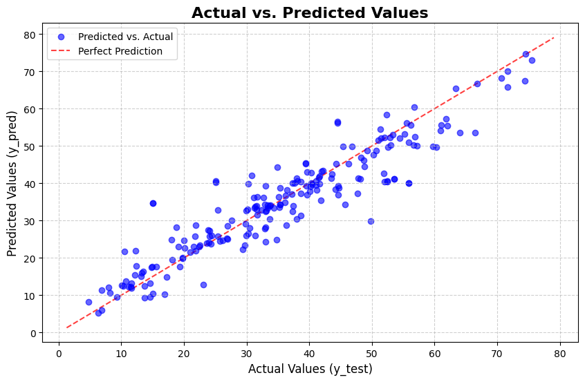

# 🧪 Data-Driven Concrete Strength Prediction

This project applies **machine learning** to a core civil engineering challenge: predicting the **compressive strength** of concrete. Using a **Random Forest Regressor**, it estimates strength based on the mix components—enabling optimization for **performance**, **cost**, and **sustainability**.

> ✅ Successfully used on *"The Ark"* construction project to select a mix with **10% higher predicted strength**.

---

## 🎯 Goal & Motivation

Traditional mix design methods are empirical and slow. This project provides a **data-driven alternative** to:

- ⚡ Rapidly estimate strength from mix proportions  
- 🧠 Optimize mix designs more efficiently  
- 🏗️ Support faster, smarter material decisions

---

## 📊 Key Results

### 🔹 Model Performance

| Metric                  | Score     |
|-------------------------|-----------|
| R-squared (R²)          | `0.87`    |
| Mean Absolute Error (MAE) | `5.81 MPa` |

---

### 🔹 Predicted vs Actual Strength

---

### 🔹 Feature Importance

---

## 🧰 Tech Stack

| Component       | Technology                          |
|------------------|--------------------------------------|
| Model           | `RandomForestRegressor` (scikit-learn) |
| Data Libraries  | Pandas, NumPy                        |
| Visualization   | Matplotlib, Seaborn                  |
| Tuning          | GridSearchCV                         |

---
